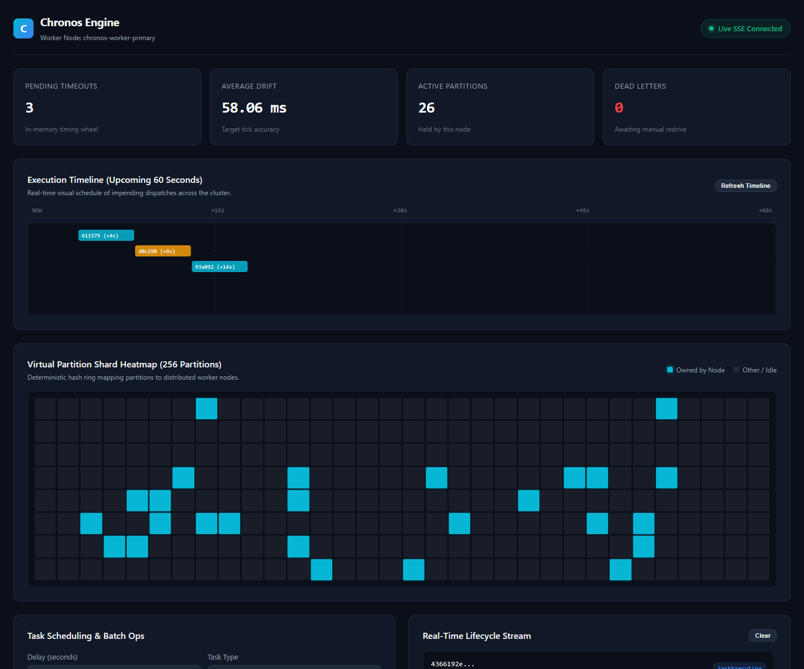
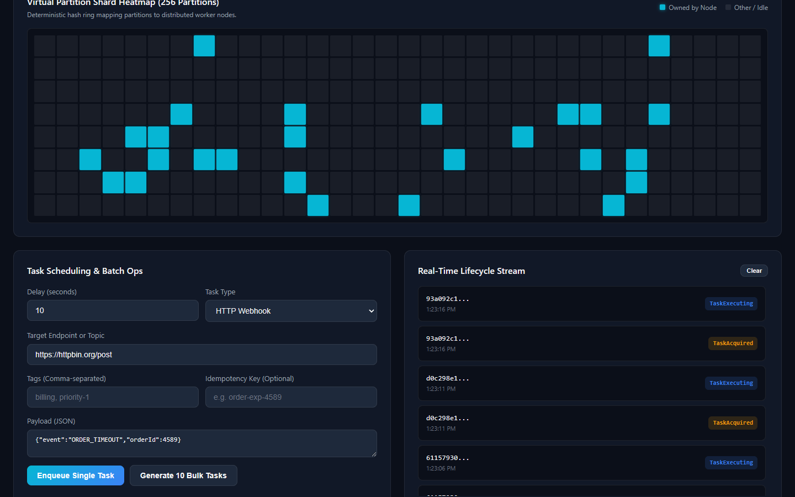

<h1 align="center">Chronos Engine</h1>

<p align="center">
  <a href="https://github.com/alexandrmotologa/chronos-engine/actions/workflows/ci.yml"></a>
  
  
  
  
  
</p>

<p align="center">
  Distributed delayed task and scheduling engine built on Java 21 Virtual Threads, an in-memory timing wheel, and PostgreSQL partition leases.<br>
  <em>Because unlike the White Rabbit, your tasks are never late.</em>
</p>

<p align="center">
  
</p>

---

```
                  +-----------------------------------+
                  |         HTTP / Kafka API          |
                  +-----------------+-----------------+
                                    |
                        (Schedule / Cancel / Query)
                                    v
+-------------------------------------------------------------------------+
|                              Chronos Core                               |
|                                                                         |
|  +------------------------+                     +--------------------+  |
|  |   Hashed Wheel Timer   |                     | Partition Worker   |  |
|  |   (In-memory, O(1))    |                     | (Lease heartbeats) |  |
|  +-----------+------------+                     +---------+----------+  |
|              |                                            |             |
|              +--------------------+-----------------------+             |
|                                   |                                     |
|                       Java 21 Virtual Threads                           |
|                       (Concurrent Dispatchers)                          |
+-----------------------------------+-------------------------------------+
                                    |
             +----------------------+----------------------+
             |                                             |
             v                                             v
  +--------------------+                         +--------------------+
  | Webhook Dispatcher |                         |  Kafka Dispatcher  |
  |  (HTTP/2 client)   |                         |  (Message topics)  |
  +--------------------+                         +--------------------+
```

## Problem Statement

Distributed systems often need tasks executed at an exact future time:
- Expiring checkout reservations after fifteen minutes.
- Retrying failed external API calls with exponential backoff and randomized jitter.
- Deactivating expired trial subscriptions across multi-tenant accounts.

Traditional background workers using database polling suffer from high table lock contention or frequent full table scans. In-memory tools such as Spring `@Scheduled` lose tasks on restart and run into split-brain errors when scaled horizontally.

Chronos Engine solves this by pairing an in-memory hashed wheel timer for sub-millisecond dispatch accuracy with PostgreSQL partition leases using `SELECT ... FOR UPDATE SKIP LOCKED` for durability.

## Architecture

Chronos follows strict Hexagonal Architecture (Ports and Adapters):

- `domain`: Pure Java 21 records and models. Contains zero dependencies on Spring, Hibernate, or external frameworks.
- `application`: Use case handlers, retry calculators, and orchestration logic.
- `infrastructure`: Concrete adapters for PostgreSQL persistence, virtual thread dispatchers, Kafka publishers, and REST controllers.

Read [docs/architecture.md](docs/architecture.md) for module boundaries and [docs/state_machine.md](docs/state_machine.md) for the complete task lifecycle.

## Enterprise Features

- **Java 21 Virtual Threads**: Millions of concurrent delayed callbacks without OS thread exhaustion.
- **Hashed Wheel Timer**: O(1) task scheduling and bucket traversal.
- **Distributed Partition Leases**: 256 virtual buckets balanced across active cluster instances.
- **HMAC Webhook Signatures**: Outgoing webhooks are signed using HMAC-SHA256 (`X-Chronos-Signature`, `X-Chronos-Timestamp`) to prevent payload tampering and replay attacks.
- **W3C Distributed Tracing**: Generates and propagates standard W3C `traceparent` headers across all dispatched tasks for end-to-end trace correlation with OpenTelemetry and Datadog.
- **Bulk Scheduling API**: Ingest batches of tasks atomically in a single transaction via `POST /api/v1/tasks/bulk`.
- **Operational Controls**: Reschedule, pause, and resume tasks on the fly via dedicated endpoints (`/reschedule`, `/pause`, `/resume`).
- **Multi-Tenancy & Tag-Based Cancellation**: Tag tasks with customer or business categories, query by tag, and cancel all tasks under a tag in one call (`DELETE /api/v1/tasks?tag=...`).
- **Transactional Outbox Engine**: Microservices can insert tasks directly into the `chronos_outbox` table within their own business transactions, and Chronos ingests them with zero message loss.
- **Interactive SVG Gantt & Shard Visualizer**: Real-time Gantt timeline for upcoming 60-second executions and a 256-partition shard heatmap rendered via Server-Sent Events at `/dashboard`.
- **Automatic Failover**: Orphan harvester reclaims tasks within ten seconds if a node crashes.
- **Idempotency Keys**: Prevents duplicate scheduling on client retries.
- **Dead Letter Queue with Redrive**: Inspect failed executions and re-queue tasks through the REST API.

## Live Dashboard & Operations Console

Open `http://localhost:8080/dashboard` in your browser to monitor cluster health, observe the 256-partition shard distribution, track timer drift, inspect upcoming dispatches on the interactive SVG Gantt timeline, and trigger immediate task actions.

<p align="center">
  
</p>

## Requirements

- Java 21 LTS
- Maven 3.9+
- PostgreSQL 16+
- Docker & Docker Compose (optional, for running dependencies locally)

## Quickstart

### 1. Start PostgreSQL

```bash
docker run -d \
  --name chronos-postgres \
  -e POSTGRES_DB=chronos \
  -e POSTGRES_USER=postgres \
  -e POSTGRES_PASSWORD=postgres \
  -p 5432:5432 \
  postgres:16-alpine
```

### 2. Build and run the engine

```bash
mvn clean package
java -jar target/chronos-engine-0.1.0-SNAPSHOT.jar
```

Flyway executes database migrations automatically on application startup.

For standalone local experimentation with zero external database setup, run with the in-memory profile:

```bash
java "-Dspring.profiles.active=local" -jar target/chronos-engine-0.1.0-SNAPSHOT.jar
```

### 3. Schedule a delayed webhook

Schedule a webhook to fire in 30 seconds:

```bash
curl -X POST http://localhost:8080/api/v1/tasks \
  -H "Content-Type: application/json" \
  -d '{
    "idempotencyKey": "order-cancel-9821",
    "scheduledTime": "'$(date -u -d "+30 seconds" +"%Y-%m-%dT%H:%M:%SZ")'",
    "type": "WEBHOOK",
    "target": "https://api.example.com/webhooks/orders",
    "payload": "{\"orderId\": 9821, \"action\": \"EXPIRE\"}",
    "tags": ["orders", "billing"],
    "retryPolicy": {
      "maxAttempts": 3,
      "initialIntervalMs": 1000,
      "multiplier": 2.0,
      "jitterFactor": 0.2
    }
  }'
```

### 4. Bulk schedule tasks

```bash
curl -X POST http://localhost:8080/api/v1/tasks/bulk \
  -H "Content-Type: application/json" \
  -d '{
    "tasks": [
      {
        "target": "https://api.merchant.com/v1/orders/1/expire",
        "scheduledTime": "'$(date -u -d "+15 seconds" +"%Y-%m-%dT%H:%M:%SZ")'",
        "payload": "{\"orderId\": 1}",
        "tags": ["bulk-batch", "orders"]
      },
      {
        "target": "https://api.merchant.com/v1/orders/2/expire",
        "scheduledTime": "'$(date -u -d "+30 seconds" +"%Y-%m-%dT%H:%M:%SZ")'",
        "payload": "{\"orderId\": 2}",
        "tags": ["bulk-batch", "orders"]
      }
    ]
  }'
```

## Configuration Options

Configure Chronos via `application.yml` or environment variables:

| Property | Default | Description |
|---|---|---|
| `chronos.cluster.node-id` | Auto-generated UUID | Unique identifier for the running instance |
| `chronos.cluster.heartbeat-interval-ms` | `3000` | Lease renewal frequency |
| `chronos.cluster.lease-duration-ms` | `10000` | Duration before an unattended task is treated as orphaned |
| `chronos.timer.tick-duration-ms` | `100` | Duration of each wheel tick in milliseconds |
| `chronos.timer.wheel-size` | `512` | Number of buckets in the circular wheel |
| `chronos.worker.batch-size` | `200` | Tasks fetched per database lease round |
| `chronos.dispatcher.http.signing-secret` | Empty | Shared secret for generating HMAC-SHA256 signatures |
| `chronos.outbox.poll-interval-ms` | `500` | Frequency in milliseconds for polling pending outbox entries |

## Testing and Verification

Run unit, architectural rule, and enterprise tests:

```bash
mvn test
```

## License

This project is licensed under the MIT License. See [LICENSE](LICENSE) for details.
