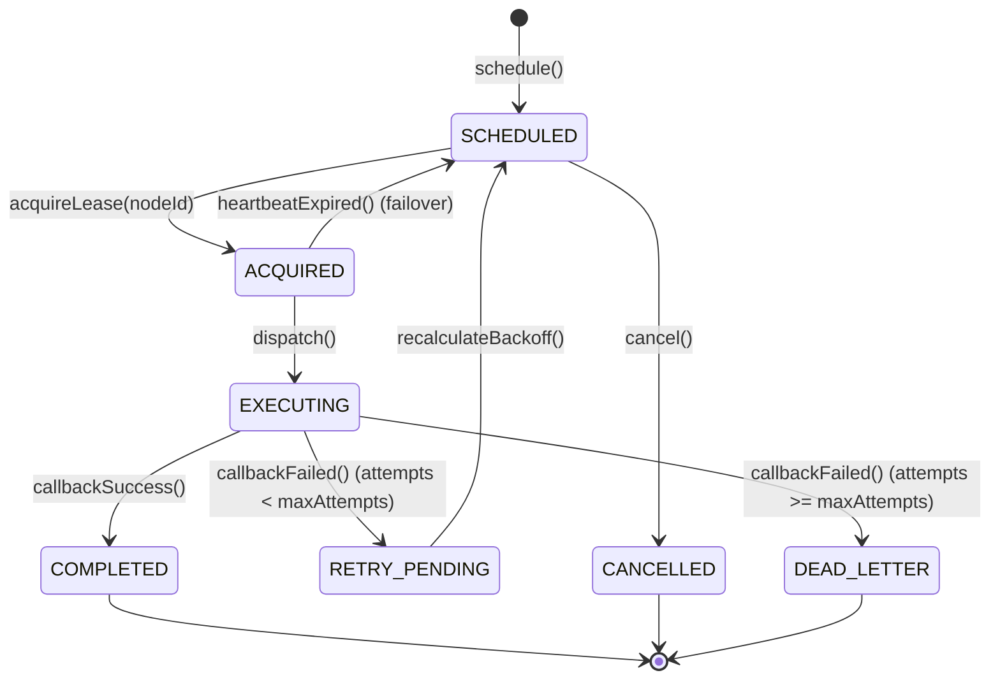

# Task State Machine

Chronos Engine enforces deterministic state transitions for all scheduled tasks. State changes occur atomically within the database and emit sealed domain events.

## State diagram



## State definitions

| State | Description |
|---|---|
| `SCHEDULED` | Task is stored in the database awaiting execution window. |
| `ACQUIRED` | A worker node locked the task partition and loaded the task into its local timing wheel. |
| `EXECUTING` | The timing wheel fired; a virtual thread is currently invoking the target webhook or Kafka topic. |
| `COMPLETED` | Dispatch succeeded with HTTP 2xx or confirmed Kafka acknowledgment. |
| `RETRY_PENDING` | Dispatch failed with a retriable error. The engine calculated the next backoff timestamp. |
| `DEAD_LETTER` | Maximum retry attempts exhausted. The task sits in the dead letter queue awaiting manual redrive. |
| `CANCELLED` | Explicit cancellation requested by a client via the REST API before dispatch. |

## Failover recovery

A task held in `ACQUIRED` or `EXECUTING` requires continuous lease renewal from the owning worker node.

Each lease contains:
- `lease_owner`: Unique identifier of the worker node.
- `lease_expires_at`: UTC timestamp set to current time plus lease duration (default ten seconds).

If an owning node loses network connectivity or crashes, its lease expires. The `OrphanHarvester` background process checks for expired leases every five seconds:

```sql
UPDATE chronos_tasks
SET status = 'SCHEDULED',
    lease_owner = NULL,
    lease_expires_at = NULL,
    updated_at = NOW()
WHERE status IN ('ACQUIRED', 'EXECUTING')
  AND lease_expires_at < NOW();
```

This ensures zero dropped tasks without risking double execution on active nodes.
